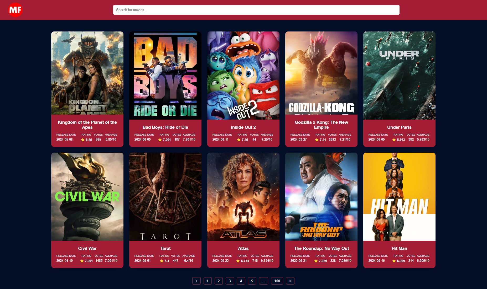
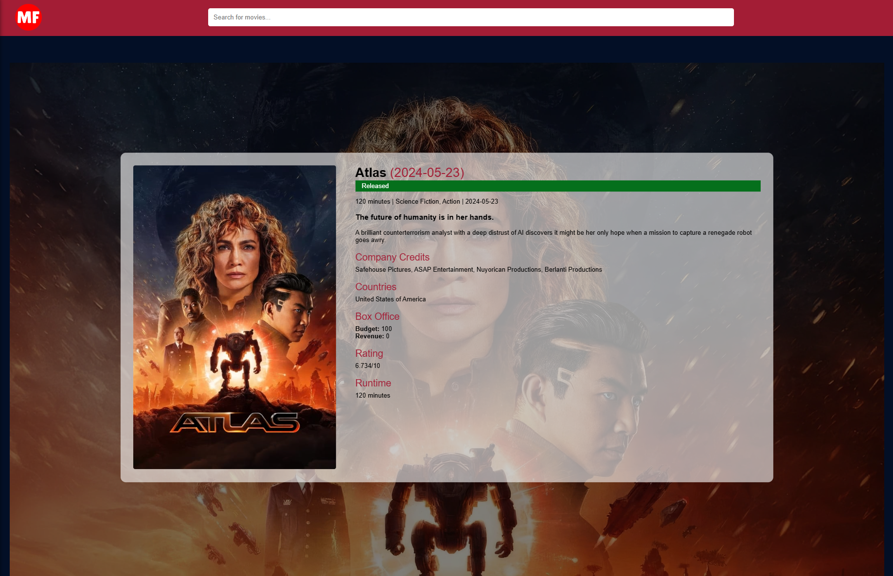

# Movie Finder Application

This web application allows users to search for movies, view detailed information about each movie, and navigate through a list of movies with pagination.

## Screenshots

## Features

- Search: Enter a movie title to search for movies.
- Details: View comprehensive details about each movie, including its poster, title, release date, rating, overview, and more.
- Pagination: Navigate through multiple pages of movie results for extended browsing

## Technologies used

- React
- Redux + Redux Toolkit
- React Router
- TypeScript
- SCSS
- Vite
- ReactPaginate
- axios

## Installation and Running

1. Clone the repository.
2. Navigate into the project directory: `cd movie-application`
3. Run `npm install` to install dependencies.
4. Create a `.env` file in the root directory and add your API key:
5. Run `npm run dev` to start the development server.

## Usage

- Enter a movie title in the search bar to search for movies.
- Browse through the list of movies displayed if needed navigate through the pages at the bottom
- Click on a movie to view its details.

## Tests

Run `npm test` to execute tests.

- [@vitejs/plugin-react](https://github.com/vitejs/vite-plugin-react/blob/main/packages/plugin-react/README.md) uses [Babel](https://babeljs.io/) for Fast Refresh
- [@vitejs/plugin-react-swc](https://github.com/vitejs/vite-plugin-react-swc) uses [SWC](https://swc.rs/) for Fast Refresh

# EXTRA NOTES:

One thing you may have noticed is that in a Vite project, index.html is front-and-central instead of being tucked away inside public. This is intentional: during development Vite is a server, and index.html is the entry point to your application.

Vite treats index.html as source code and part of the module graph. It resolves <script type="module" src="..."> that references your JavaScript source code. Even inline <script type="module"> and CSS referenced via <link href> also enjoy Vite-specific features. In addition, URLs inside index.html are automatically rebased so there's no need for special %PUBLIC_URL% placeholders.
