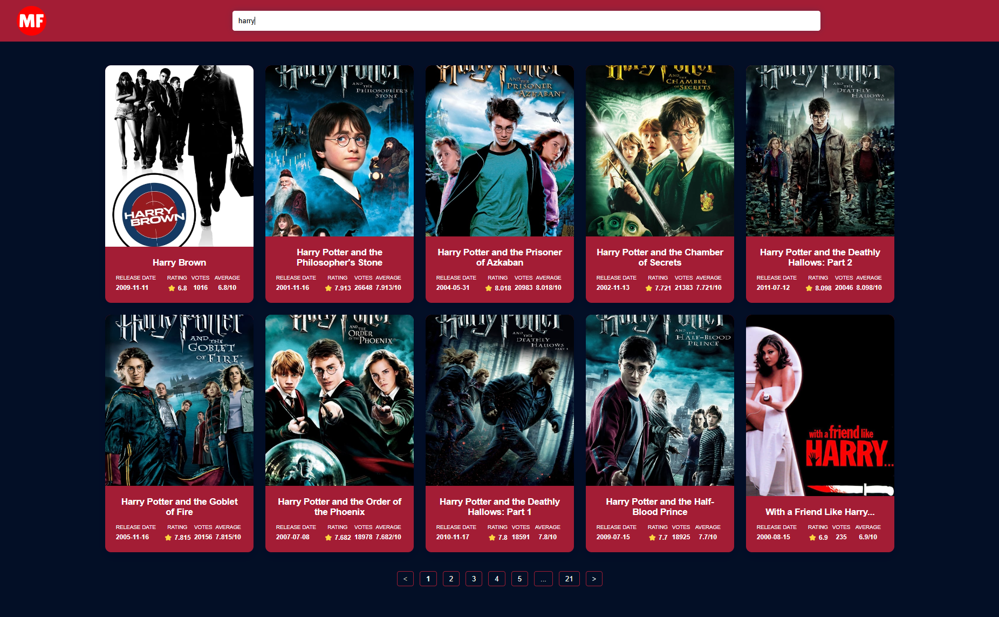

# Movie Finder Application

This web application allows users to search for movies, view detailed information about each movie, and navigate through a list of movies with pagination.

## Screenshots

## Features

- Search: Enter a movie title to search for movies.
- Details: View comprehensive details about each movie, including its poster, title, release date, rating, overview, and more.
- Pagination: Navigate through multiple pages of movie results for extended browsing

## Technologies used

- React
- Redux + Redux Toolkit
- React Router
- TypeScript
- SCSS
- Vite
- ReactPaginate
- axios
- vitest

## Installation and Running

1. Clone the repository.
2. Navigate into the project directory: `cd movie-application`
3. Run `npm install` to install dependencies.
4. Create a `.env` file in the root directory and add your API key:
5. Run `npm run dev` to start the development server.

## Usage

- Enter a movie title in the search bar to search for movies.
- Browse through the list of movies displayed if needed navigate through the pages at the bottom
- Click on a movie to view its details.

## Tests

Run `npm test` to execute tests.

# PERSONAL NOTES:
1. These weeks were very challenging for me, I had a lot of stuff to do and was traveling. Despite I've spent around 10-15 hours to complete this task. Didn't have much time for testing and styling (I already see some issues in styling).
Also, one thing to consider, at first I implemented my own pagination showing 10 items per page and another half on the second page, fetching of new pages happened in even page numbers (e.g 1,3,5,7), because there is no parameter to fetch only 10 movies per request. However, I decided to roll up this logic and simply implement react-paginate with slicing and displaying only 10 movies of the request object since I think that manipulating in that way is not a good practice and in real production it shouldn't be considered in that way. 
2. I am open to any suggestions and discussions, please feel free to ask questions during the next round if my app passes review.
# EXTRA NOTES
1. One thing you may have noticed is that in a Vite project, index.html is front-and-central instead of being tucked away inside public. This is intentional: during development, Vite is a server, and index.html is the entry point to your application.

Vite treats index.html as source code and part of the module graph. It resolves <script type="module" src="..."> that references your JavaScript source code. Even inline <script type="module"> and CSS referenced via <link href> also enjoy Vite-specific features. In addition, URLs inside index.html are automatically rebased so there's no need for special %PUBLIC_URL% placeholders.
